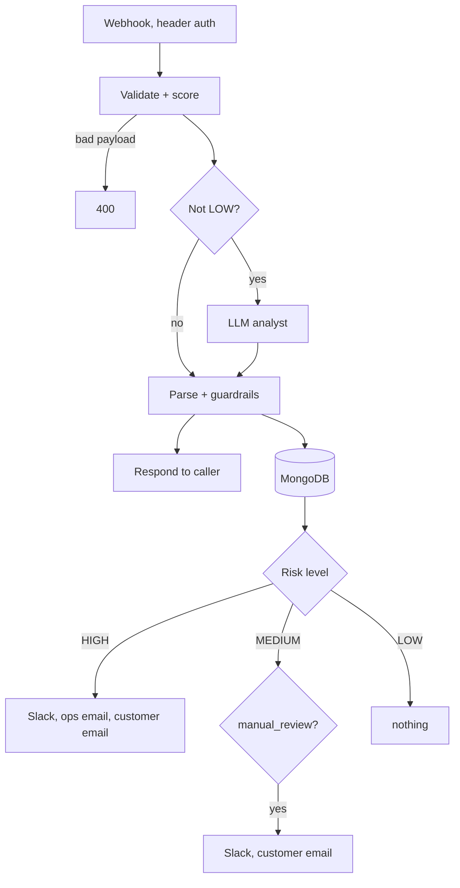

# Fraud check workflow for n8n


A webhook that scores incoming orders for fraud risk and tells your shop backend what to do with them: allow, monitor, send to manual review, or block.

The score itself comes from a handful of plain rules. An LLM then reads the result and writes a short note for the fraud team and a neutral message for the customer. It never gets to change the score, and it can't soften a decision the rules already made. If OpenAI is down or returns garbage, the workflow still works and falls back to the rules alone.

Everything is stored in MongoDB, and Slack and email notifications go out depending on the risk level.

## Flow



The caller gets its answer right after the decision is made. Saving to the database and sending notifications happen in parallel and don't hold up the response.

## Calling it

```
POST https://<your-n8n-host>/webhook/fraud-check
X-API-Key: <your secret>
Content-Type: application/json
```

The header name depends on how you set up the Header Auth credential, `X-API-Key` is just an example. While testing, use `/webhook-test/fraud-check` instead.

Required fields: `order_id`, `customer_email`, `amount`, `currency` (ISO 4217, like `EUR`), `country` and `ip_country` (two-letter ISO 3166-1 codes).

Optional fields and their defaults when missing:

| Field | Default |
|---|---|
| `ip_address` | empty |
| `card_attempts_24h` | 0 |
| `orders_24h` | 0 |
| `email_age_days` | 365 |
| `items_count` | 1 |
| `shipping_billing_mismatch` | false |

Example:

```bash
curl -X POST https://<your-n8n-host>/webhook/fraud-check \
  -H "Content-Type: application/json" \
  -H "X-API-Key: <your secret>" \
  -d '{
    "order_id": "ORD-10042",
    "customer_email": "buyer@example.com",
    "amount": 1500,
    "currency": "EUR",
    "country": "DE",
    "ip_country": "RU",
    "card_attempts_24h": 5,
    "email_age_days": 3
  }'
```

Response:

```json
{
  "event_id": "FRD-1760000000000-a1b2c3",
  "order_id": "ORD-10042",
  "risk_score": 85,
  "risk_level": "HIGH",
  "recommended_action": "manual_review",
  "triggered_signals": ["country_mismatch", "high_order_value", "new_email", "multiple_card_attempts"],
  "decision_source": "rules+ai",
  "rules_version": "2026.10"
}
```

`decision_source` is `rules+ai` when the model answered properly, and `rules` when it was skipped (LOW orders) or failed.

A bad payload gets a 400 with the reason, for example `{"error": "invalid_request", "message": "currency must be a 3-letter ISO 4217 code"}`. A missing or wrong API key is rejected by n8n before the workflow runs.

## How scoring works

| Signal | Triggers when | Points |
|---|---|---|
| country_mismatch | `country` differs from `ip_country` | 25 |
| high_order_value | amount is 1000 or more | 20 |
| new_email | email is younger than 14 days | 15 |
| multiple_card_attempts | 4+ card attempts in 24h | 25 |
| multiple_orders_24h | 5+ orders in 24h | 15 |
| shipping_billing_mismatch | flag is true | 15 |
| large_item_count | 8+ items | 10 |

The total is capped at 100. 70 and above is HIGH, 40 to 69 is MEDIUM, anything lower is LOW.

What the model is allowed to recommend depends on the level:

- HIGH: `manual_review` or `block`
- MEDIUM: `monitor` or `manual_review`
- LOW: always `allow`, and the model isn't called at all

If the model suggests something outside its range, the Parse node quietly corrects it. A HIGH order marked `allow` becomes `manual_review`, a MEDIUM order marked `block` becomes `manual_review`, and so on.

## Who gets notified

- **HIGH:** Slack message, email to the fraud team, and a "payment review" email to the customer.
- **MEDIUM with manual_review:** Slack message and the customer email.
- **MEDIUM with monitor:** nothing, it's only stored.
- **LOW:** nothing.

Separately, Slack gets a message if the database write fails or if the workflow itself errors out. The customer email is deliberately bland: no scores, no rule names, no links, no promises about timing.

## Setup

1. Import `fraud_check_workflow_v2.json` (Workflows, then Import from File).
2. Create credentials and attach them: Header Auth for the webhook, OpenAI, MongoDB, Slack, Gmail.
3. Open the first Code node ("Normalize Order & Build Risk Signals") and edit `CONFIG` at the top. Company name, the fraud team's email, thresholds and weights all live there.
4. Invite the Slack bot to `#fraud-alerts`, or change the channel name in the Slack nodes.
5. In the workflow settings, set this same workflow as its own Error Workflow. Without that the failure alert never fires.
6. Activate it and point your backend at the production URL.

You need an n8n version that ships the LangChain nodes (Agent and OpenAI Chat Model). The model is set to `gpt-5-mini` with a 20 second timeout and one retry.

## Storage

Events go into a `fraud_events` collection in MongoDB. It's worth adding a unique index so replayed requests can't create duplicates:

```js
db.fraud_events.createIndex({ event_id: 1 }, { unique: true })
```

Each document holds the normalized order, the score, the triggered signals, the assessment, the final action, `rules_version`, and whether the LLM was used.

## Privacy

Customer email and IP address are never sent to OpenAI, the model only sees the fields it needs to judge the order. Order fields are also marked as untrusted data in the prompt, and the model's output is cleaned up afterwards (links removed from the customer message, Slack mentions neutralized).

The database does contain emails and IP addresses though, so decide how long you keep them and who can read them. If you have EU customers, that's a GDPR question.

## When things break

- Invalid payload: 400 with a message.
- OpenAI fails or returns something unparseable: the rules decide, and `decision_source` says so.
- MongoDB write fails: Slack alert, the order is still processed.
- Slack or Gmail fail: the other branches carry on. Slack retries twice.
- Anything else: the Error Trigger posts to Slack with the failing node and a link to the execution.

## Trying it out

| Case | What to send | What you should see |
|---|---|---|
| Low | `ES` / `ES`, amount 120 | score 0, `allow`, no notifications |
| Medium | `DE` / `RU`, amount 1500 | score 45, `monitor` or `manual_review` |
| High | the example above | score 85, Slack plus two emails |
| Bad input | `"currency": "euro"` | 400 |
| No key | omit the header | rejected by n8n |

## Changing the rules

Bump `rulesVersion` in `CONFIG` whenever you touch thresholds or weights. It's saved with every event, so later you can tell which version of the rules made a given decision.

## Not done yet

- Deduplicating repeated calls for the same `order_id`
- A proper transactional email provider instead of Gmail
- Swapping the Agent node for a plain LLM chain with a structured output parser
- More signals: IP velocity, card BIN country, disposable email domains
- Feeding confirmed fraud cases back in to tune the weights
