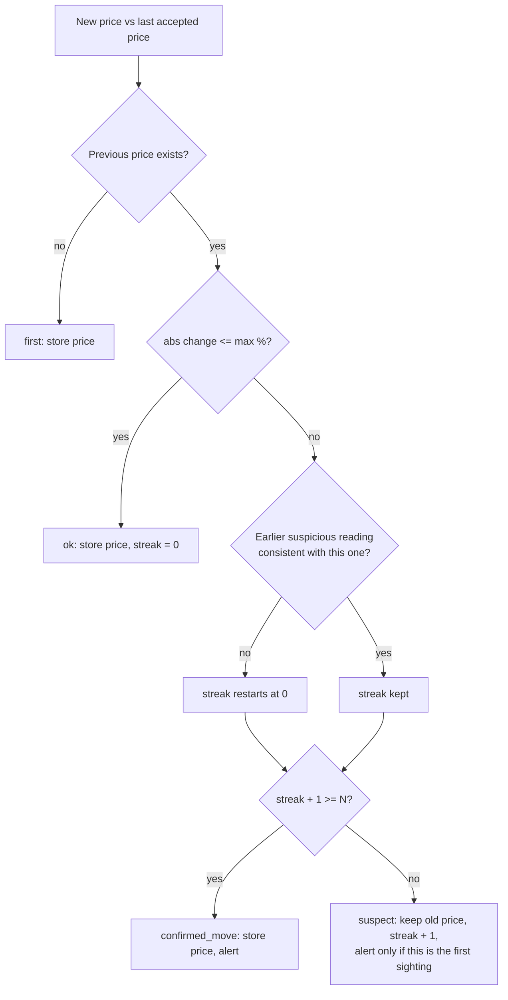

# Crypto Rates Sync with Anomaly Guard — n8n


A scheduled n8n workflow that keeps cryptocurrency prices in MongoDB up to date **without ever trusting a single reading blindly**. It fetches prices from a primary source with an automatic fallback, compares every new price with the last accepted one, holds suspicious jumps until they are confirmed, tracks the health of the data sources, and reports problems to WhatsApp.

---

## Features

| Area | What it does |
|---|---|
| **Scheduled sync** | Fetches prices for a configurable list of assets every 5 minutes |
| **Source fallback** | CoinGecko is primary; Binance is used when the primary request fails **or returns incomplete / invalid data** |
| **Anomaly guard** | A price that jumps more than a threshold is **not written**; it is held until N consecutive, mutually consistent readings confirm it |
| **No permanent lock-out** | A real market crash is accepted after confirmation instead of being rejected forever |
| **Price history** | Every accepted price is appended to a history collection for charts and audits |
| **Alert digest** | All anomalies of one run are sent as a **single** WhatsApp message |
| **Outage detection** | Failed runs are counted in MongoDB; alert after N failures in a row, then at most once per cooldown |
| **Recovery notice** | A message when the sync works again after an alerted outage |
| **Retryable alerts** | If an outage alert cannot be delivered, the monitor state is not advanced and the alert is retried on the next run |
| **Global error handler** | Error Trigger sends the failing node, error message and execution link to WhatsApp |
| **Configurable** | Assets, currency and every threshold live in one `Config` node |

---

### Design notes

- **Valid-looking is not the same as valid.** A response with HTTP 200 but a missing or non-positive price is treated as a failure and triggers the fallback, exactly like a timeout.
- **Error outputs instead of crashes.** Both HTTP nodes use *Continue (using error output)* with 2 retries, so a failing source becomes a normal branch of the flow.
- **State lives in the database, not in the workflow.** The anomaly streak and the failure counter are stored in MongoDB, so the logic survives restarts and works across scheduled executions.
- **`alwaysOutputData` on `find`.** An empty collection would otherwise return zero items and silently stop the workflow. Both lookups return one empty item and the Code nodes filter real documents.
- **Explicit node references.** Database nodes replace `$json`, so downstream Code nodes read their inputs with `$('Node Name')`. The failure path uses `try/catch` references because only some of those nodes run in any given execution.
- **Alert deduplication by design.** Anomaly alerts fire only when a suspicion starts or is confirmed, not on every run in between.

---

## Anomaly guard

For every asset, each run compares the new price with the **last accepted** price stored in MongoDB.



| Status | Meaning | Price written? | History row? | Alert? |
|---|---|---|---|---|
| `first` | No previous price for this asset | yes | yes | no |
| `ok` | Change within `max_change_pct` | yes | yes | no |
| `suspect` | Jump above the threshold, not yet confirmed | **no** (old price kept) | no | once, on the first sighting |
| `confirmed_move` | `confirm_readings` consecutive readings agree on the new level | yes | yes | yes |

"Consistent" means the new reading is within `max_change_pct` of the previous *suspicious* reading. If it is not (a wild, unstable feed), the streak restarts.

### Example timeline (BTC, `max_change_pct = 10`, `confirm_readings = 3`, 5-minute schedule)

| Time | Raw price | Last accepted | Change | Status | Stored price | Alert |
|---|---|---|---|---|---|---|
| 12:00 | 60,000 | 59,800 | +0.3% | `ok` | 60,000 | — |
| 12:05 | 75,000 | 60,000 | +25% | `suspect` (streak 1) | 60,000 | ⚠️ |
| 12:10 | 75,400 | 60,000 | +25.7% | `suspect` (streak 2) | 60,000 | — |
| 12:15 | 75,200 | 60,000 | +25.3% | `confirmed_move` | **75,200** | ✅ |
| 12:20 | 75,300 | 75,200 | +0.1% | `ok` | 75,300 | — |

A single glitchy tick (for example 12:05 followed by a return to ~60,000) never reaches the database: the next reading is `ok` and the streak resets.

> **Time to confirm = `confirm_readings` × schedule interval** (15 minutes with the defaults). Keep this in mind when changing either value.

### Example alert

```text
Rates monitor (source: coingecko)

BTC: suspicious jump, price NOT updated
   60,000 → 75,000 EUR (+25%)

ETH: move confirmed after 3 consistent readings
   2,400 → 2,010 EUR (-16.25%) - price UPDATED
```

---

## Source health monitoring

The workflow tracks the health of its own data feed in the `monitor_state` collection (document `job: "rates_sync"`).

| Event | Behaviour |
|---|---|
| Successful run | `consecutive_failures = 0`, `last_success_at` refreshed, `last_alert_at` cleared |
| Failed run (both sources) | `consecutive_failures + 1`, error reasons stored |
| `consecutive_failures >= failure_alert_after` | WhatsApp alert with the reason per source and **how old the last good price is** |
| Outage continues | Repeat alert at most once per `alert_cooldown_min` |
| Recovery after an alerted outage | `✅ Rates sync recovered after N failed run(s)` |

Short blips (1–2 failed runs) are recorded but stay silent, and recovery messages are only sent if an outage alert was actually sent.

### Example outage alert

```text
Rates sync failing (3 runs in a row)
Primary (CoinGecko): request failed: 429 Too Many Requests
Fallback (Binance): request failed: 451
Last good update: 17 min ago
Prices in the database are stale until a source recovers.
```

The outage alert node has **no** "continue on error". If WhatsApp delivery fails, the monitor document is left unchanged, so the same alert is attempted again on the next run instead of being silently lost.

---

## Data model

### MongoDB collections

**`rates`** — one document per asset (key: `asset`)

```json
{
  "asset": "BTC",
  "currency": "EUR",
  "price": 61234.5,
  "source": "coingecko",
  "updated_at": "2026-10-09T12:15:00.000Z",
  "last_checked_at": "2026-10-09T12:15:00.000Z",
  "change_pct": 0.42,
  "anomaly_streak": 0,
  "last_suspect_price": null
}
```

`updated_at` is when the **accepted price** last changed; `last_checked_at` is when the workflow last looked. Consumers should use `updated_at` to detect stale data.

**`rate_history`** — append-only: `asset`, `currency`, `price`, `source`, `status`, `fetched_at`

**`monitor_state`** — one document (key: `job = "rates_sync"`): `status` (`ok` / `down`), `consecutive_failures`, `last_success_at`, `last_failure_at`, `last_error`, `last_alert_at`

### Recommended indexes

```js
db.rates.createIndex({ asset: 1 }, { unique: true });
db.monitor_state.createIndex({ job: 1 }, { unique: true });
db.rate_history.createIndex({ asset: 1, fetched_at: -1 });
```

> **Retention:** a TTL index only works on BSON `Date` fields, but the workflow writes ISO strings. Either add `fetched_at` to the *Date Fields* option of the `Append History` node and then create a TTL index on it, or purge old rows with a scheduled cleanup.

---

## Setup

### Requirements

- An n8n instance
- MongoDB
- WhatsApp Business Cloud API access (Meta app, phone number ID, access token)
- No API keys for the data sources are required for light usage (see [limitations](#known-limitations))

### Steps

1. **Import** `rates_sync.json` (*Workflows → Import from file*).
2. **Create credentials** (MongoDB and WhatsApp) and attach them to the nodes.
3. **Set the schedule:** open `Every 5 Minutes` and make sure *Minutes Between Triggers* is **5**.
4. **Enable Upsert** in the three MongoDB *update* nodes: `Update Price`, `Mark Monitor OK`, `Update Monitor (failure)`. Without it the very first run cannot create documents, so no prices and no monitor state would ever be stored.
5. **Fill in `Config`:** WhatsApp recipient and phone number ID, assets, thresholds.
6. **Fill in `Error Alert`:** it cannot read `Config`, so set its phone number ID and admin recipient directly.
7. **Create the MongoDB indexes** (recommended).
8. **Set the error workflow:** *Workflow settings → Error Workflow →* select this workflow.
9. **Activate** the workflow.

> WhatsApp numbers: digits only, with country code, no `+`.

---

## Configuration

All keys are in the **`Config`** node.

| Key | Default | Purpose |
|---|---|---|
| `assets` | BTC, ETH, SOL | JSON array of `{ "id": "<CoinGecko id>", "symbol": "<ticker>" }` |
| `vs_currency` | `eur` | Quote currency |
| `max_change_pct` | `10` | Change per run above which a price is treated as suspicious |
| `confirm_readings` | `3` | Consecutive consistent suspicious readings needed to accept a jump |
| `failure_alert_after` | `3` | Failed runs in a row before the first outage alert |
| `alert_cooldown_min` | `60` | Minimum time between repeated outage alerts |
| `alert_whatsapp` | placeholder | Recipient of all alerts |
| `whatsapp_phone_number_id` | placeholder | WhatsApp Business phone number ID |

### Adding an asset

```json
[
  { "id": "bitcoin",  "symbol": "BTC" },
  { "id": "ethereum", "symbol": "ETH" },
  { "id": "solana",   "symbol": "SOL" }
]
```

- `id` is the CoinGecko coin id.
- `symbol` is the ticker used as the database key **and** to build the Binance fallback pair (`SYMBOL` + currency, for example `BTCEUR`). Make sure that pair exists on Binance, otherwise the fallback can never succeed for that asset.
- The asset definitions are validated on every run; an invalid entry fails fast with a clear error.

---

## Using the rates in other workflows

Read `rates` with a MongoDB *find* node and **always check freshness** before using a price:

```js
const rate = $input.first().json;                       // document from the "rates" collection
const ageMin = (Date.now() - new Date(rate.updated_at).getTime()) / 60000;

if (ageMin > 30) throw new Error(`Rate for ${rate.asset} is stale (${Math.round(ageMin)} min)`);

const amountEur = amountInAsset * rate.price;
```

This is also how the other workflows in this repository can stop comparing raw amounts: a fraud rule such as `amount >= 1000` is only meaningful once the amount is converted to a single currency.

---

## Testing

Use *Execute workflow* from the editor to trigger a run manually.

| Scenario | How to trigger | Expected result |
|---|---|---|
| First run | Empty `rates` collection | Every asset `first`, documents created, history rows written |
| Normal update | Run twice | Status `ok`, `change_pct` small |
| Suspicious jump | In MongoDB, double the stored `price` of one asset, then run | `suspect`, price kept, `anomaly_streak = 1`, **one** WhatsApp digest |
| Confirmation | Keep the stored price changed and run 3 times in total | `confirmed_move` on the third run, price accepted, alert |
| Transient glitch | Change the stored price, run once, restore it, run again | Second run is `ok`, streak back to 0 |
| Fallback | Put an unknown CoinGecko id into `assets` | Fallback source used (check `source` in `rates`) |
| Outage | Break both sources (invalid asset *and* unreachable URL) | Failure counted; alert once `failure_alert_after` is reached (set it to `1` to test quickly) |
| Alert cooldown | Keep the outage going | No new alert until `alert_cooldown_min` has passed |
| Recovery | Restore the sources after an alerted outage | One recovery message, `monitor_state.status = ok` |
| Error handler | Break the MongoDB credential | WhatsApp message from `Error Alert` |

Tip: to test the timing of confirmations without waiting, temporarily set `confirm_readings` to `2`.

---

## Known limitations

- **Free API limits.** CoinGecko's free tier is rate-limited and Binance is blocked in some regions (HTTP 451). Both appear as failures and are handled, but a permanently unavailable fallback means no redundancy. Add an API key or another source for production use.
- **The two sources are not identical.** CoinGecko reports an aggregated price, Binance the last trade on one exchange. Differences of a fraction of a percent are normal and far below the default threshold, but they can appear when the active source switches.
- **No cross-validation.** Only one source is used per run. A wrong value from the primary source that still looks plausible (inside the threshold) is accepted. A median over three sources would remove this weakness.
- **One threshold for all assets.** Volatile and stable assets share `max_change_pct`.
- **Updates are not atomic.** Assets are written one by one; a failure in the middle leaves some assets updated and some not.
- **Run overlap.** If an execution takes longer than the interval, runs may overlap. With two fast HTTP calls this is unlikely, but consider limiting concurrency for slow setups.
- **WhatsApp 24-hour window.** Free-form messages reach a recipient only within 24 hours of their last message to your business number. For production alerts use an approved *template* message.
- **History growth.** `rate_history` grows by up to one row per asset per run; plan retention (see [data model](#data-model)).
- **Thresholds are examples.** Tune `max_change_pct`, `confirm_readings` and the schedule against your real volatility and latency requirements.

---

## Possible extensions

- Per-asset thresholds (stablecoins vs. altcoins)
- Third source and median / quorum validation
- Fiat exchange rates (for example ECB) with the same guard
- A read-only webhook endpoint that serves cached rates with a freshness field
- Scheduled summary of price coverage and source availability from `rate_history`
- Feeding converted amounts into the fraud-check workflow
